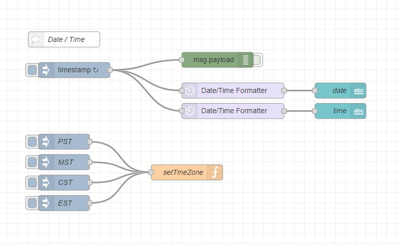
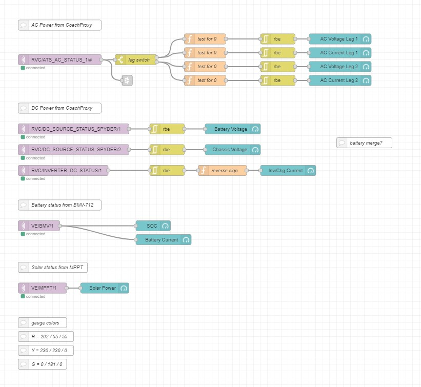
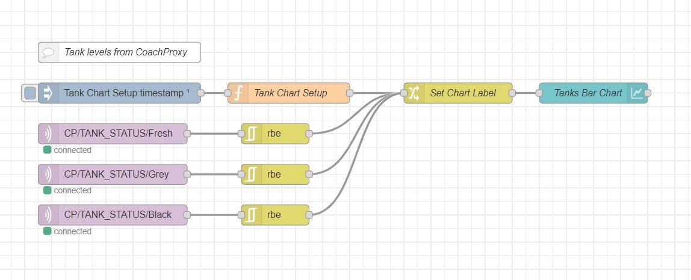
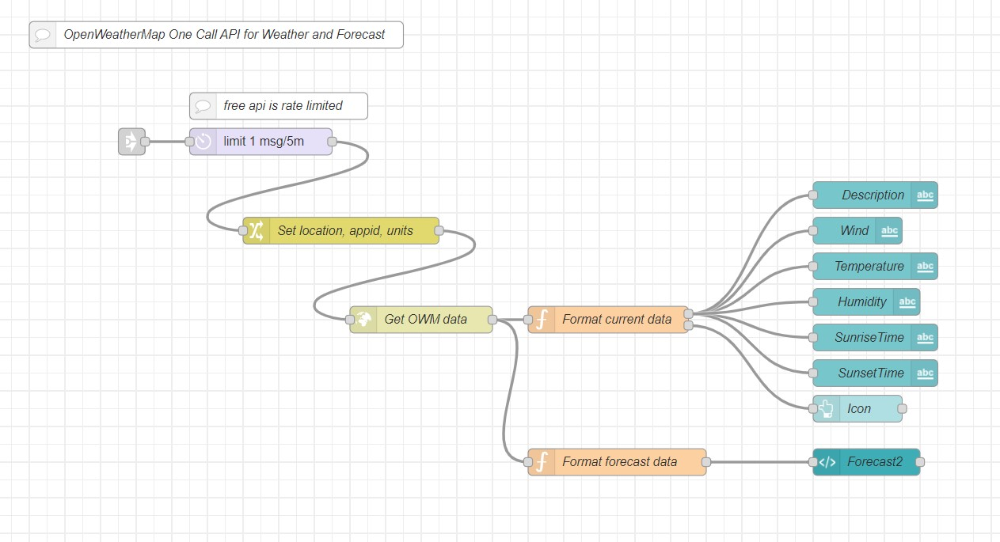
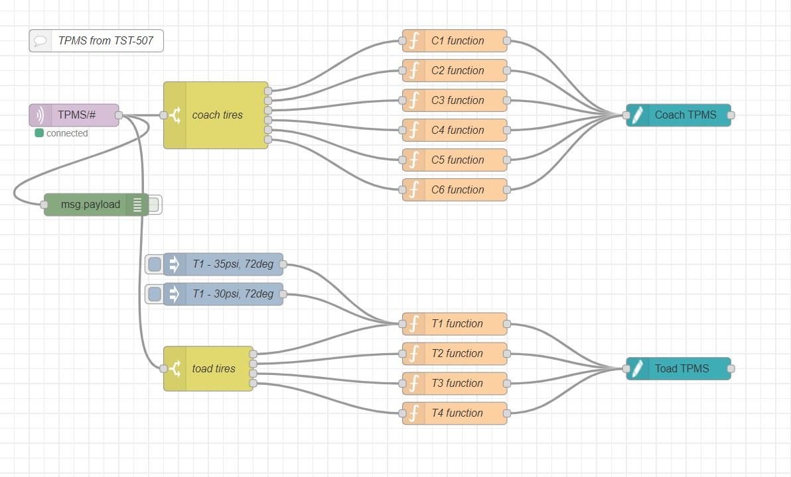
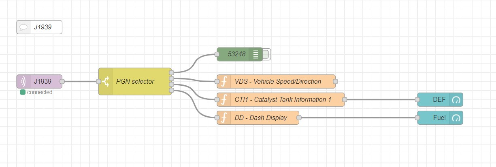
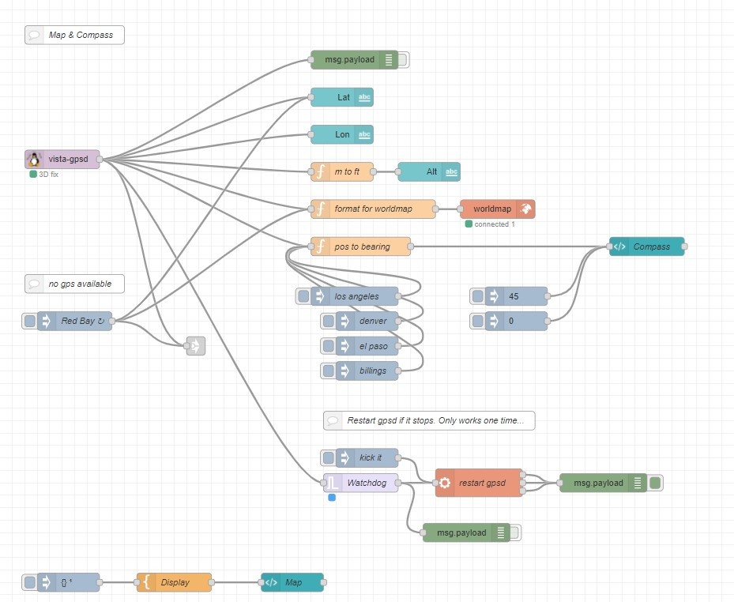
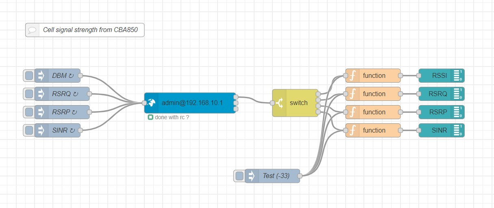

# Vista
Node-Red Dashboard for RV system status

## Description
"Vista" is a dashboard that shows a conglomeration of status data from multiple systems of a modern recreational vehicle (RV). The software is mostly composed of Node-Red and a MQTT server.  It runs under Linux on an Intel NUC and feeds a television in the RV via HDMI.

## Hardware
 - Intel NUC.  I use this because I had one laying around, it't small, runs Linux, and has HDMI output to feed the front TV of my RV.  Any similar system should work just fine.  A Raspberry Pi would be a good choice.

## Software
 - Linux.  Linux is the operating system of choice.  While I'm sure you could implement Vista in Windows, why would you?
 - Node-RED.  Vista is really just a collection of Node-RED flows.  https://nodered.org
 - MQTT Server.  MQTT is a messaging service run by the system and also other systems feeding data to Vista.  Vista is a client and a broker of MQTT messages. https://mqtt.org/

## Inputs
 - CoachProxyOS.  A system connected to the RV-C network in an RV.  It runs on a Raspberry Pi and makes RV system status available via its own Node-Red interface.  It is primarily written for Tiffin Motorhomes, but there are individuals working on expanding it's coverage to other makes and models.  https://github.com/linuxkidd/coachproxy-os 
 - J1939.  A chassis CAN bus connecting the engine, transmission, aftertreatment, dashboard, lights, braking, and other systems together.  It is not directly tied to RV-C.  It usually has diagnostic ports available at various places including under the dash and back by the engine.  I use another Rpi board connected to a CopperHill jCOM.J1939.USB board that plugs into the diagnostic port under the dash.  https://copperhilltech.com/a-brief-introduction-to-the-sae-j1939-protocol
 - Victron BMV & MPPT.  Vista gets battery status from a Victron battery monitor and solar panel/charger status from a Victron MPPT.  Both devices have ESP8266/ESP32 devices attached that periodically send messages to Vista via MQTT.  The Arduino library used for these devices is here: https://github.com/cterwilliger/VeDirectFrameHandler
 - Cradlepoint CB850.  This is a cellular modem that provides internet connectivity to the RV.  Vista periodically querries it for cell tower signal strength. 
 - GPS.  The Cradlepoint modem has GPS capabilities built in.  GPS coordinates are used by Vista to generate a position map, compass, and get current location weather.
 - OpenWeatherMap.  Used to generate current weather.  https://openweathermap.org
 - OpenStreetMap.  Used to generate the position map.  https://www.openstreetmap.org
 - Ikea Vindrikning.  A cute device available from Ikea that measures air quality.  It can be modified to generate and broadcast data via MQTT.  https://github.com/Hypfer/esp8266-vindriktning-particle-sensor

## Node-RED flows
Node-RED is a programming tool for wiring together hardware devices, APIs and online services.  All flows used by Vista are broken up into functional groups so you can pick and choose which ones to use.  I am NOT an expert in Node-RED and don't claim to write the most efficient and fool-proof flows.  All flows are proven to work in _my_ setup.  I'm sure there are ways to improve all of them.  It's a work in progress... 

The flows are contained in the folder "flows".  They are compacted text files that can be copied and imported into a Node-RED instance.  I have included jpg image files of the flows in the "img" folder.

### Date/Time flow
This flow creates the date & time banner at the top.

### Power flow
This flow displays AC & DC power as well as solar power and battery state of charge.

### Temperatures flow
This flow displays Temperatures of the generator bay, battery bay, and wet bay.  Certainly other temperatures could be displayed if desired.

### Tanks flow
This flow displays the levels of the fresh, black, and grey tanks.

### Weather flow
This flow shows current and forcasted weather for the RV's current location.  Location is determined by GPS coordinates.  OpenWeatherMap has many options and other weather products available that could be displayed.  A free account from OpenWeatherMap will give you access to most everything you need, but be careful of their query rate limits.

### TPMS flow
This flow displays TPMS data from a TST-507 system.  The flow could be easily adapted to other TPMS formats, but does require specific backend hardware and software to deliver the data to the flow.

### J1939 flow
This flow is only pulling data for the fuel and DEF levels.  This also requires additional hardware and software to feed the flow.  Keep in mind that the J1939 bus is only active while the ignition key is ON.

### Map & Compass flow
This flow shows a map from OpenStreetMap and an aviation style compass rose.  The flow gets data from onboard GPS.  The compass computes its values from successive GPS coordinates while moving.  This means it is not accurate while not moving.  It could easily be fed from a dedicated compass module.  My RV, a 2019 model, while having a compass module that feeds the RV dash, does not make that available to the RV-C network.

### Network flow
This flow shows the four main signal strenth values from a cellular modem.  This is highly dependent on the specific modem you are using.  Other things could be integrated such as download/upload speeds.

